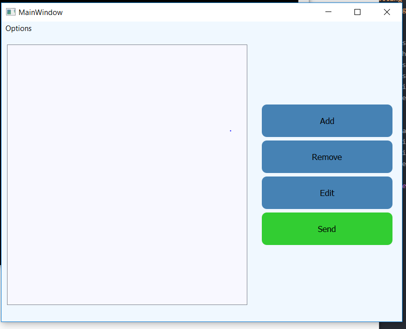
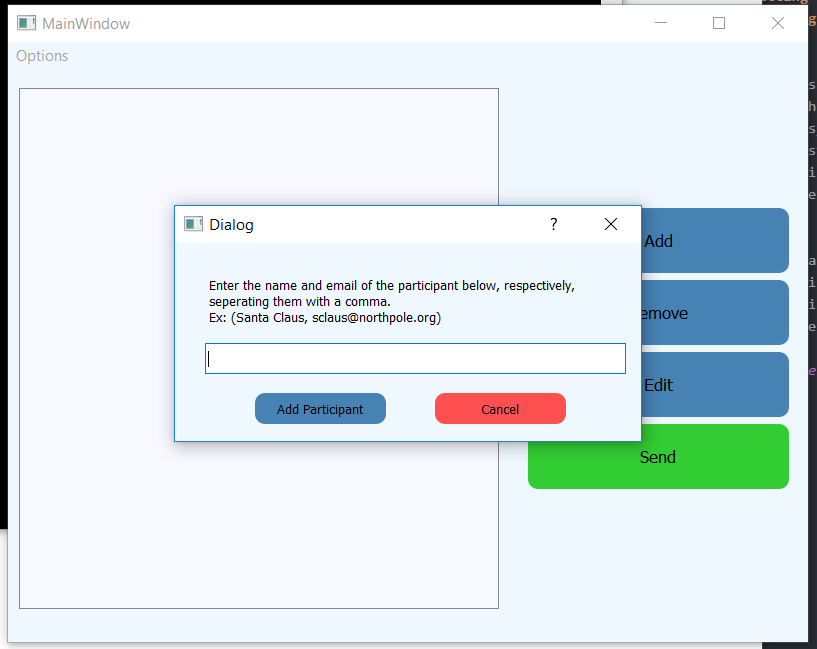
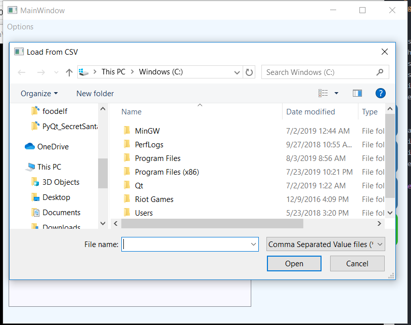
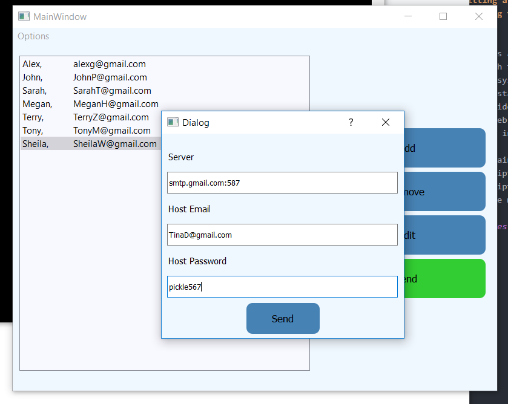

# PyQt5 Project: Secret Santa GUI Application
****
**Purpose: A simple application that you can use to coordinate a Secret Santa with a group of friends**

Description: A simple side project to kind of learn and understand GUI fundamentals and the PyQt5(Qt) framework. It is compiled into an executable using cx_freeze, which you can find in the dist_2.0 folder. This folder includes the scripts and the libraries necessary to run the executable, so if you just want the application, download this folder solo. NOTE: Depending on your machine, you may need to recompile the main python file (SecretSantaProgram.py) using [cx_freeze](https://cx-freeze.readthedocs.io/en/latest/overview.htmlsecre).

**How To Use:**

  1 - Add participants to list with name and email separated by a comma (Ex:"Alex, AlexG@gmail.com"), or (from options) load a .csv file of participants with names in the first column and emails in the second column.

  MainWindow
  

  Add Dialog
  

  Load CSV
  

  2 - Click "Send" button and a dialog will pop-up where you will input the email smtp server that you will be using, the host email, and the host password.
  

  3 - Hit Send!
